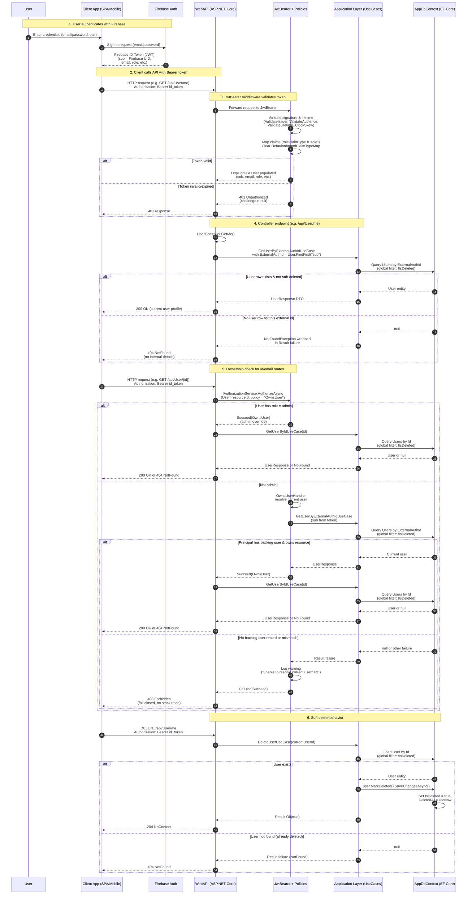

# 005 – WebAPI auth refinements: Firebase JWT, policies, /me endpoints, and failure behavior

- **Status**: Accepted
- **Date**: 2026-01-23
- **Related issues**: GitHub `issue #15`, `issue #16`, `issue #17`, `issue #19`

## Context

After ADR 003 and 004, the WebAPI had basic JWT bearer authentication and controller-level ownership checks for user endpoints. However, several gaps remained:

- JWT configuration was still fairly generic and did not fully embrace Firebase ID token semantics (issuer/audience and role claim mapping).
- Authorization rules were partially implemented via controller helpers instead of reusable ASP.NET Core policies and handlers.
- The routing surface for user management forced clients to supply `id` or `email` even for self-service operations, increasing the risk of IDOR-style issues.
- While the code generally failed closed on exceptional conditions, we lacked explicit tests to ensure that authentication/authorization failures always resulted in 401/403/404 and never leaked internal error details.

From a security perspective, this relates mainly to:

- OWASP Top 10 2025 – **A01: Broken Access Control** (inconsistent enforcement of ownership/admin rules).
- OWASP Top 10 2025 – **A10: Mishandling of Exceptional Conditions** (ensuring failures in authN/authZ code paths do not result in insecure behavior or information leakage).

## Decision

We refined the WebAPI authentication and authorization stack as follows.

### 1. Firebase-oriented JWT configuration and role mapping (issue 15)

- In `WebAPI/Authentication/JwtAuthenticationExtensions.cs` we:
  - Read `Authentication:Authority` and `Authentication:Audience` from configuration.
  - Configure `JwtBearer` to strictly validate:
    - `ValidIssuer = Authentication:Authority`.
    - `ValidAudience = Authentication:Audience`.
    - `ValidateIssuer = true`, `ValidateAudience = true`, `ValidateLifetime = true`.
    - `ClockSkew = 2 minutes` to keep token reuse windows small.
  - Clear `JwtSecurityTokenHandler.DefaultInboundClaimTypeMap` to avoid legacy claim remapping.
  - Set `TokenValidationParameters.RoleClaimType = "role"` so Firebase custom claim `role` (e.g. `admin`/`user`) is surfaced to ASP.NET Core’s role system and used by `User.IsInRole` / `[Authorize(Roles = "admin")]`.
- Appsettings (e.g. `WebAPI/appsettings.Development.json`) are configured for Firebase:
  - `Authority = "https://securetoken.google.com/<project-id>"`.
  - `Audience = "<project-id>"`.

### 2. Authorization policies and OwnsUser handler (issue 16)

- In `JwtAuthenticationExtensions` we introduced named policies:
  - `AdminOnly` – requires `role = "admin"` claim.
  - `User` – requires an authenticated user (convenience wrapper).
  - `OwnsUser` – enforces resource ownership or admin override via a custom requirement/handler.
- We registered `OwnsUserHandler : AuthorizationHandler<OwnsUserRequirement, Guid>` in `WebAPI/Authorization`:
  - Fails closed if the principal is not authenticated.
  - Grants access if the user is admin (supports both role claim and Firebase custom `role` claim).
  - Otherwise:
    - Reads the external auth id from `sub` or `NameIdentifier` claims.
    - Calls `GetUserByExternalAuthIdUseCase` to resolve the current user.
    - If resolution fails, logs and **does not** call `context.Succeed` (authorization fails closed).
    - If resolved and `currentUser.Id == targetUserId`, calls `context.Succeed`.
- `UserController` was updated to:
  - Inject `IAuthorizationService` and apply `AuthorizeAsync(User, id, "OwnsUser")` for `/{id}` and email-based routes instead of using a bespoke helper.
  - Return `Forbid()` when authorization fails, delegating ownership/admin logic to the handler.

### 3. `/me` endpoints and tightened user routes (issue 17)

- `UserController` now exposes self-service endpoints that derive identity from the JWT rather than client-supplied ids/emails:
  - `GET /api/User/me` – returns the current authenticated user profile.
  - `PUT /api/User/me/name` – updates the current user’s display name.
  - `DELETE /api/User/me` – deletes the current user.
- These endpoints use a shared helper `GetCurrentUserAsync` that:
  - Extracts the external auth id from the principal’s claims (`sub` / `NameIdentifier`).
  - Calls `GetUserByExternalAuthIdUseCase` to resolve the `User` record.
  - Returns either `(UserResponse, null)` or `(null, IActionResult)` where the `IActionResult` is `NotFound` or `Forbid` depending on the failure mode.
- The existing id/email-based endpoints remain, but their usage is clarified:
  - Normal users can only access their own resources; admins can access any user.
  - Ownership and admin checks are enforced via `OwnsUser` and `AdminOnly`, not by ad-hoc controller logic.
- Integration tests (`UserControllerIntegrationTests`) were updated to:
  - Exercise `/me` for read, update, and delete flows.
  - Verify that after deleting via `/me`:
    - `GET /api/User/me` returns `404 NotFound` (no backing user record).
    - `GET /api/User/{id}` returns `403 Forbidden` because authorization fails closed when the principal no longer maps to a user.

### 4. Auth/authorization failure-path tests (issue 19)

- We added tests in `UserControllerAuthorizationTests` to assert behavior under exceptional conditions:
  - `GetMe_ShouldReturnNotFound_WhenCurrentUserRecordDoesNotExist`:
    - Sends `GET /api/User/me` with an external id that has no corresponding user row.
    - Expects `404 NotFound`, confirming the controller/logging path is used and no 500/stack trace is exposed.
  - `GetUserById_ShouldReturnForbidden_WhenPrincipalHasNoBackingUserRecord`:
    - Seeds a target user whose external id differs from the principal’s.
    - Sends `GET /api/User/{id}` for a principal with an external id that does not exist in the DB.
    - Expects `403 Forbidden`, confirming that the `OwnsUser` policy fails closed without throwing or leaking internal error details.
- Existing tests continue to validate:
  - Anonymous requests are rejected with 401.
  - Normal users can only access their own resources.
  - Admins can operate on other users when `role = admin` is present.

### 5. End-to-end authentication and authorization flow

The following diagram summarizes the full flow from a user authenticating with Firebase to invoking WebAPI endpoints that enforce authentication, authorization, and soft-delete semantics:

## Consequences

### Positive

- **Stronger alignment with identity provider semantics**:
  - Issuer, audience, and lifetime checks are explicitly configured for Firebase ID tokens.
  - Role claims are mapped consistently, reducing surprises when using `[Authorize(Roles = "...")]`.
- **Centralized and testable access control**:
  - Ownership and admin behavior are encapsulated in the `OwnsUser` policy/handler instead of hand-written per-controller helpers.
  - `/me` endpoints reduce reliance on client-supplied identifiers for self-service operations, lowering the risk of IDOR.
- **Secure failure behavior**:
  - When the current principal cannot be resolved to a user, the system returns 404 for `/me` and 403 for `/{id}` routes.
  - New tests enforce that failures in user resolution or missing claims do not result in 200s or 500s.

### Negative / Trade-offs

- **Increased complexity in WebAPI**:
  - Additional concepts (policies, custom handler, `/me` routes) increase the surface area for new contributors.
- **Error semantics may require client education**:
  - Clients must understand that 403 vs 404 can reflect different failure modes (authorization vs missing user).
- **Test vs production divergence**:
  - Tests use `TestAuthHandler` and `X-Test-Only-*` headers to simulate identities and roles, which developers must remember do not apply in production.

## Alternatives considered

1. **Continue using controller-level ownership checks only**
   - Rejected because it scatters access-control logic and makes it easy to miss a check on new endpoints.
   - Policy/handler-based design better supports centralized reasoning and reuse.

2. **Expose only id-based endpoints and rely on clients to know their own id**
   - Rejected in favor of `/me` endpoints that derive identity from the JWT, which is less error-prone and more secure.

3. **Return 404 for all authorization failures**
   - Considered, but we chose to distinguish between:
     - Missing backing user (`/me` → 404), and
     - Authorization failures where the user exists but doesn’t own the resource (`/{id}` → 403),
   - to provide clearer semantics while still failing closed.

## Implementation references

- JWT configuration and policies: `clean-architecture/WebAPI/Authentication/JwtAuthenticationExtensions.cs`
- Authorization handler and requirement: `clean-architecture/WebAPI/Authorization/OwnsUserRequirement.cs`, `OwnsUserHandler.cs`
- User controller and `/me` endpoints: `clean-architecture/WebAPI/Controllers/UserController.cs`
- WebAPI tests for authn/z behavior:
  - `clean-architecture/Tests/WebAPI.Tests/UserControllerAuthorizationTests.cs`
  - `clean-architecture/Tests/WebAPI.Tests/UserControllerIntegrationTests.cs`
  - `clean-architecture/Tests/WebAPI.Tests/TestAuthHandler.cs` (test-only auth)
